```{r setup, include=FALSE}
library(tidyverse)
library(gapminder)
library(here)
options(htmltools.dir.version = FALSE, 
        tibble.max_extra_cols = 6, 
        tibble.width = 60)
knitr::opts_chunk$set(echo = TRUE,
                      warning = FALSE, 
                      message = FALSE, 
                      tidy = FALSE, 
                      fig.align = 'center',
                      dpi = 320)
```

```{r xaringan-themer, include=FALSE, warning=FALSE}
library(xaringanthemer)
# xaringanthemer::style_duo(primary_color = "#F0FFFF", secondary_color = "#CD0000")
xaringanthemer::style_duo_accent(primary_color = "#035AA6", secondary_color = "#03A696")
```

```{r xaringan-inf_mr, echo=FALSE, eval=FALSE, include=FALSE}
# xaringan::inf_mr() # for instant knitting and reviewing
```

```{r rmarkdown_wizards, echo=FALSE, out.width="100%", out.height="100%"}
knitr::include_graphics("img/rmarkdown_wizards.png")
```

.pull-right[Artwork by @allison_horst]


---
background-image: url(img/rmarkdown.png)
background-position: 93% 10%
background-size: 8%

# Materials 

### Link to slides: 


### Link to exercises: 


---
background-image: url(img/rmarkdown.png)
background-position: 93% 10%
background-size: 8%

# Getting set up 

## Make sure you've created a Github account

If you haven't, head over to Github and create a free account. 

.pull-left[

#### *Follow this link:* 

https://github.com/join

]

--

.pull-right[

```{r create-github-account, echo=FALSE, out.width="150%", out.height="150%"}
knitr::include_graphics("img/create-github-account.png")
```

]

---
background-image: url(img/rmarkdown.png)
background-position: 93% 10%
background-size: 8%

# Getting RStudio.Cloud Set Up 

<br><br>

### Head over to RStudio.Cloud and sign in with your Github account

.pull-left[

```{r welcome-rstudio-cloud, echo=FALSE, out.width="170%", out.height="170%"}
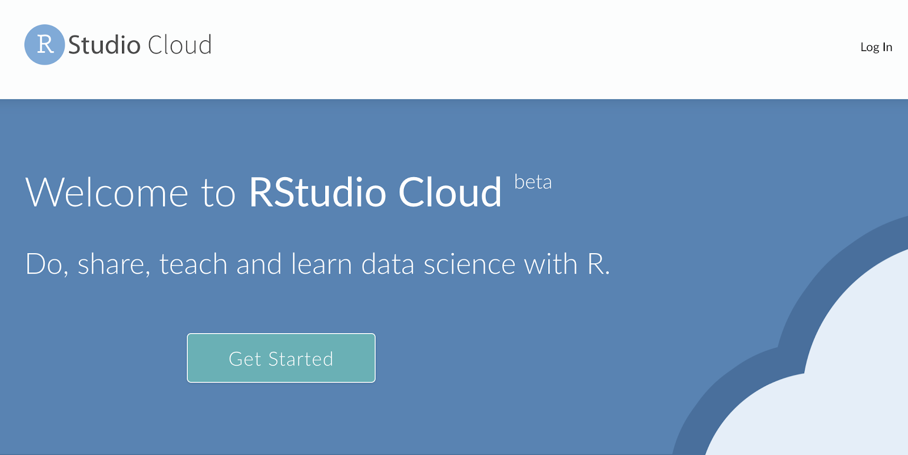
```

]

--

.pull-right[

```{r login-with-github, echo=FALSE, out.width="60%", out.height="60%"}
knitr::include_graphics("img/login-with-github.png")
```

]

---
background-image: url(img/rmarkdown.png)
background-position: 93% 10%
background-size: 8%

# Your RStudio.Cloud Workspace

### *This is where your new projects will show up!*

```{r new-rstudio-cloud-env, echo=FALSE, out.width="170%", out.height="170%"}
knitr::include_graphics(path = "img/new-rstudio-cloud-env.png")
```


---
background-image: url(img/rmarkdown.png)
background-position: 93% 10%
background-size: 8%

# Click on the link below:

https://rstudio.cloud/project/1859537

### Click *Save a Permanent Copy* and create a personal copy in your workspace

```{r save-rstudio-cloud-copy, echo=FALSE, out.width="80%", out.height="80%"}
knitr::include_graphics(path = "img/save-rstudio-cloud-copy.png")
```


---
background-image: url(img/rmarkdown.png)
background-position: 93% 10%
background-size: 8%

# What you should see

<br>

### Now you have a local copy of this RStudio project in your RStudio.Cloud workspace. 

```{r open-rstudio-cloud-project, echo=FALSE, out.width="95%", out.height="95%"}
knitr::include_graphics(path = "img/open-rstudio-cloud-project.png")
```

---
background-image: url(img/rmarkdown.png)
background-position: 93% 10%
background-size: 8%

# Installing the packages

### Run the `intall.R` file 

Copy the code below and run it in the *Console* pane and click enter/return

```{r install.R, eval=FALSE}
source("install.R")
```


```{r source-install-script, echo=FALSE, out.width="85%", out.height="85%"}
knitr::include_graphics(path = "img/source-install-script.png")
```


---
class: inverse, center
background-image: url(img/rmarkdown.png)
background-position: 93% 10%
background-size: 8%

# *What is RMarkdown?*

--

## Three technologies:

--

### 1) Markdown is a plain text markup language for capturing *human-readable* prose

--

### 2) Data manipulation/graphing/statistical language engines for computing *machine-readable* code

--

### 3) Multiple *output options* for creating PDFs, Word docs, PowerPoints, HTML, etc.

---
class: center, top

# How R Markdown works 

## `rmarkdown` works directly with `knitr`

<br>

.pull-left[

`rmarkdown` combines YAML, markdown, and R code into a markdown document and passes it to `knitr`


```{r rmarkdown, echo=FALSE, out.width="40%", out.height="40%"}

```

]

--

.pull-right[

`knitr` uses `pandoc` (a universal document conversion tool) to generate the specified document format

```{r knitr, echo=FALSE, out.width="40%", out.height="40%"}
knitr::include_graphics("img/knitr.png")
```

]

---
background-image: url(img/rmarkdown.png)
background-position: 95% 8%
background-size: 8%
class: inverse, middle, center

# Exercises

### We will create an example HTML report using the R Markdown template provided by RStudio

---
background-image: url(img/rmarkdown.png)
background-position: 95% 12%
background-size: 9%
class: left, top

# Exercise 1: create a new RMarkdown file

.pull-left[

### *File* >>> 

### *New File* >>> 

### *R Markdown... >>> * 

]


.pull-right[

***Or use the drop-down menu***

```{r new-rmarkdown, echo = FALSE, out.height="40%", out.width="40%"}
knitr::include_graphics("img/new-rmarkdown.png")
```

]

---
background-image: url(img/rmarkdown.png)
background-position: 7% 93%
background-size: 8%
class: left, top

# Install required packages 

<br>

.pull-left[

RStudio.Cloud *might* ask to install the required packages for R Markdown, Click **Yes**

```{r install-req-packages, echo = FALSE, out.height="100%", out.width="100%"}
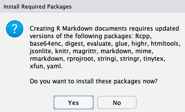
```

]

--

.pull-right[

You will see RStudio installing the packages in the **Jobs** pane

```{r rmd-pckgs-jobs, echo = FALSE, out.height="180%", out.width="180%"}
knitr::include_graphics("img/rmd-pckgs-jobs.png")
```

]


---
background-image: url(img/rmarkdown.png)
background-position: 7% 93%
background-size: 8%
class: middle

# New R Markdown

### Enter ***Title*** and ***Author*** of your report and click ***OK***

```{r rmarkdown-defaults, echo = FALSE, out.height="60%", out.width="60%"}
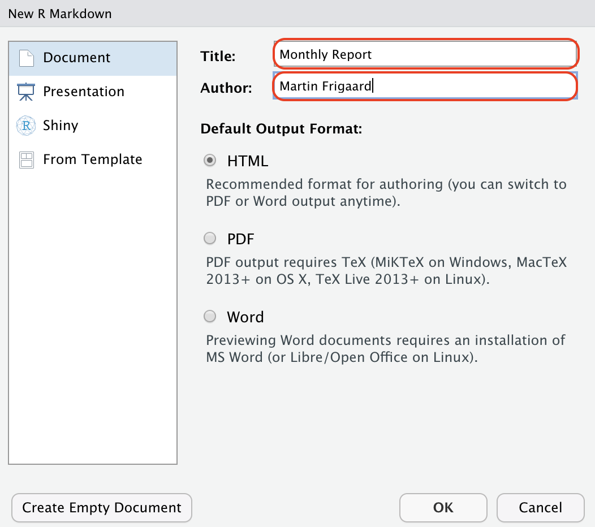
```


---
background-image: url(img/rmarkdown.png)
background-position: 7% 93%
background-size: 8%
class: left, top

# Save your `.Rmd` file

### Click on the small floppy disk to save your `.Rmd` file

### Enter a name (`01-monthly-report.Rmd`) 

```{r save-rmd-file, echo = FALSE, out.height="60%", out.width="60%"}
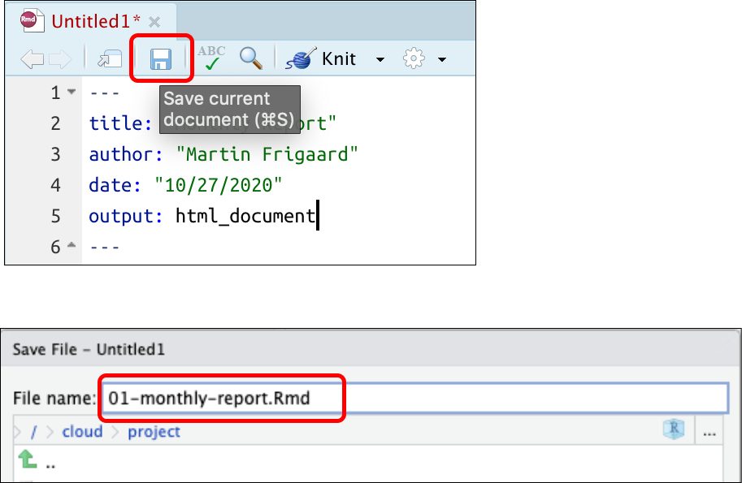
```

---
background-image: url(img/rmarkdown.png)
background-position: 7% 93%
background-size: 8%
class: left, top

# Knit your .Rmd file

### Click on the small gear, select *Preview in Viewer Pane*

### Click on the knit icon (ball of yarn)

```{r knit-rmd-file, echo = FALSE, out.height="60%", out.width="60%"}
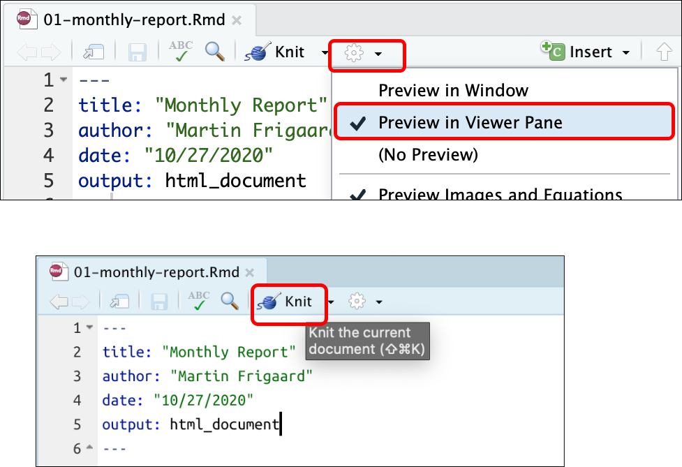
```

---
background-image: url(img/rmarkdown.png)
background-position: 93% 7%
background-size: 8%
class: left, center

## Our First R Markdown Report!

```{r rmarkdown-in-action, echo = FALSE, out.height="110%", out.width="110%"}
knitr::include_graphics("img/rmarkdown-in-action.png")
```

---
background-image: url(img/rmarkdown.png)
background-position: 95% 8%
background-size: 8%
class: inverse, middle, center

# How R Markdown Works (under the hood)

---
background-image: url(img/how-rmd-works.png)
background-position: 50% 78%
background-size: 85%
class: top, center

### R Markdown is made up of three elements

---
class: left, top

# Rmarkdown combines metadata, markdown, *and* R code 

```{r r-plus-md, echo = FALSE, out.height="70%", out.width="70%"}

```

<br>

#### The result is a file framework for creating reproducible reports using YAML, Markdown, and computer code

<br>

`.yaml` = Metadata  
`.md` = Prose   
`.R` = Code     


---
background-image: url(img/rmarkdown.png)
background-position: 93% 10%
background-size: 8%

# R Markdown: YAML

## `.yaml` = Metadata
### ~~`.md` = Prose~~  
### ~~`.R` = Code~~

--

### YAML is a human friendly data serialization standard for all programming languages.

--

### YAML stands for *'YAML Ain't Markup Language'* (funny, huh?)


---
background-image: url(img/rmarkdown.png)
background-position: 93% 10%
background-size: 8%

# R Markdown: YAML

<br><br>

### YAML contains the information about the document we're going to create

```yaml
---
title: "Monthly Report"
author: "Martin Frigaard"
date: "10/27/2020"
output: html_document
---
```

---
background-image: url(img/rmarkdown.png)
background-position: 93% 10%
background-size: 8%

# R Markdown: YAML format

<br><br>

```{r yaml-formatting-01, echo = FALSE, out.height="100%", out.width="100%"}
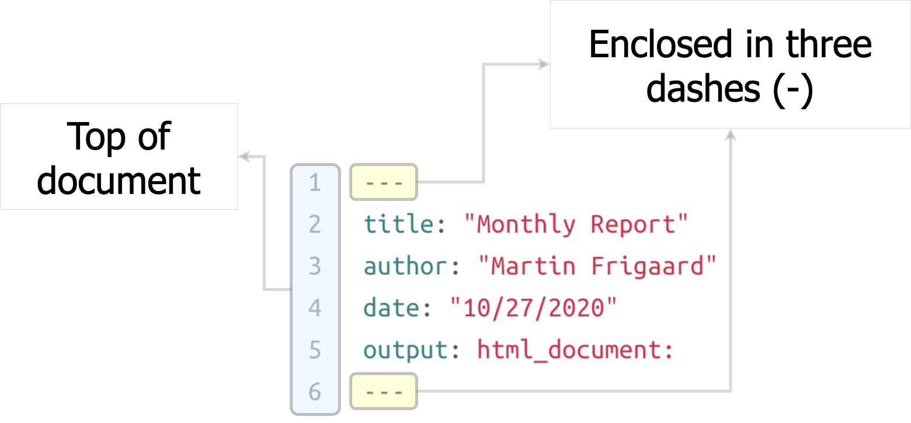
```

---
background-image: url(img/rmarkdown.png)
background-position: 93% 10%
background-size: 8%

# R Markdown: YAML format

<br><br>

```{r yaml-formatting-02, echo = FALSE, out.height="90%", out.width="90%"}
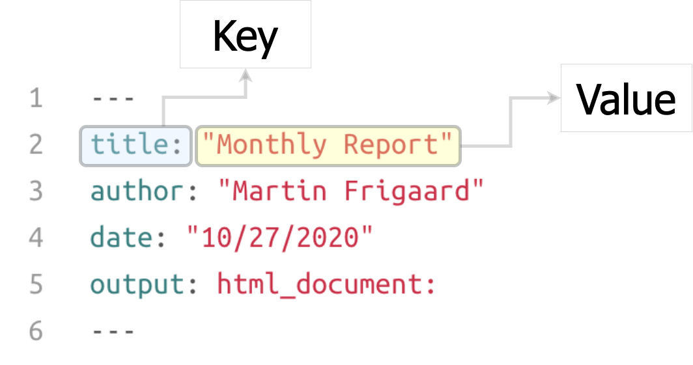
```

---
background-image: url(img/rmarkdown.png)
background-position: 93% 10%
background-size: 8%

# R Markdown: YAML

<br><br>

### There are many YAML arguments and options

### Indentation matters in YAML!!

--

<br><br>

> Check out the [YAML Fieldguide](https://cran.r-project.org/web/packages/ymlthis/vignettes/yaml-fieldguide.html) for a comprehensive list


---
background-image: url(img/rmarkdown.png)
background-position: 7% 96%
background-size: 8%

# Example YAML output options

## Table of contents: 

### `toc:` logical (`true` or `false`)

### `toc_float:` logical (`true` or `false`)

### `toc_depth:` set numerically `0` - `6`

---
background-image: url(img/rmarkdown.png)
background-position: 7% 96%
background-size: 8%

# Exercise 2: create a floating table of contents

### Change the `output` in the YAML header to the following: 

```yaml
output: 
  html_document: 
    toc: yes
    toc_float: true
```

### Knit the document again

---
background-image: url(img/rmarkdown.png)
background-position: 7% 96%
background-size: 8%

# YAML output options: table of contents 

### Floating table of contents (rendered)

```{r yaml-toc-settings, echo = FALSE, out.height="100%", out.width="100%"}
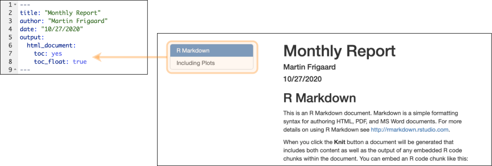
```

---
background-image: url(img/rmarkdown.png)
background-position: 7% 96%
background-size: 8%

# Exercise 3: text highlighting and themes

### Add the following two options to your YAML header

```yaml
output: 
  html_document: 
    toc: yes
    toc_float: yes
    highlight: zenburn
    theme: united

```

### Knit the document again

---
background-image: url(img/rmarkdown.png)
background-position: 7% 96%
background-size: 8%

# YAML: text highlighting and theme options 

### Text highlighting and theme options (rendered)

```{r yaml-highlight-theme, echo = FALSE, out.height="90%", out.width="90%"}
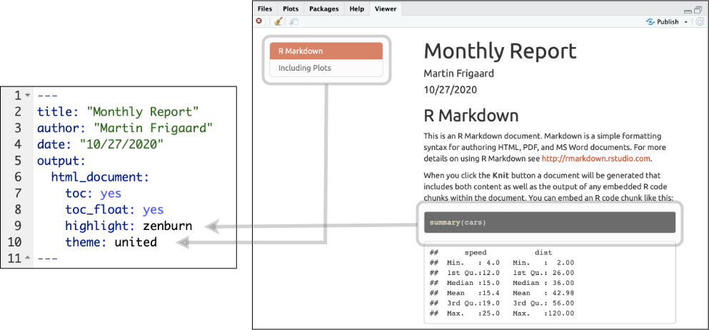
```

---
background-image: url(img/rmarkdown.png)
background-position: 7% 96%
background-size: 8%

# More YAML options

### You can change the YAML contents using the settings (small gear)

```{r knitr-settings, echo = FALSE, out.height="70%", out.width="70%"}
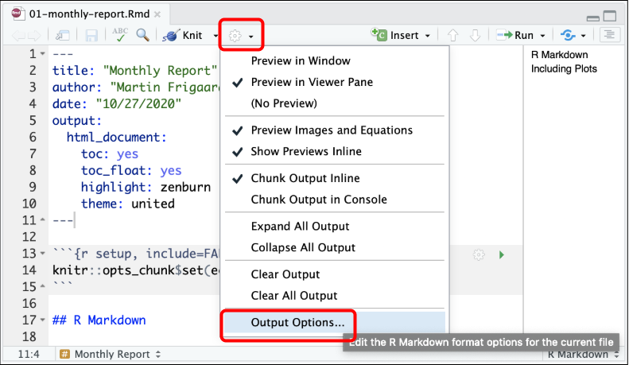
```

---
background-image: url(img/rmarkdown.png)
background-position: 7% 96%
background-size: 8%

# Edit R Markdown Document Options

.pull-left[

#### This window gives us the ability to manually change some of the YAML settings (but not all of them!)

]

--

.pull-right[

```{r edit-rmd-output-options, echo = FALSE, out.height="100%", out.width="100%"}
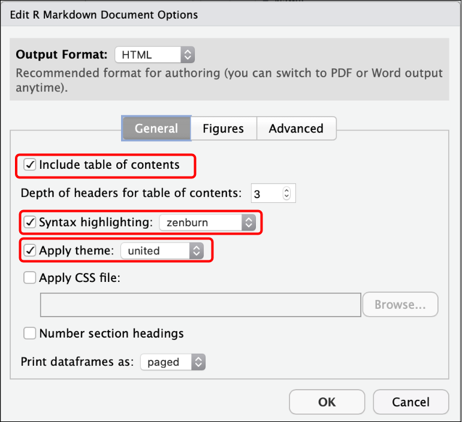
```

]

---
background-image: url(img/rmarkdown.png)
background-position: 7% 96%
background-size: 8%

# YAML Parameters

### YAML parameters can be referred to throughout the document

.pull-left[

***Create `params` in YAML header***

```yaml
params: 
  param1: x
  param2: y
  data: df
```
]

--

.pull-right[

***Refer to `params` in .Rmd document***

```{r params, eval = FALSE}
params$param1
params$param2
params$data
```
]

---
background-image: url(img/rmarkdown.png)
background-position: 7% 96%
background-size: 8%

# Exercise 4: Using YAML parameters

Add the following `params` option in the YAML header 

```yaml
params: 
  small_pressure: !r head(pressure)
```

--

Add this code to the end of the document


```{r small-pressure, echo = FALSE, out.height="100%", out.width="100%", fig.align='left'}
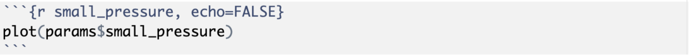
```


### Knit the document again 


---
background-image: url(img/rmarkdown.png)
background-position: 7% 96%
background-size: 8%

## See our new plot with the `params`

We can see the new plot with the reduced sample size

```{r params-plot, echo = FALSE, out.height="80%", out.width="80%"}
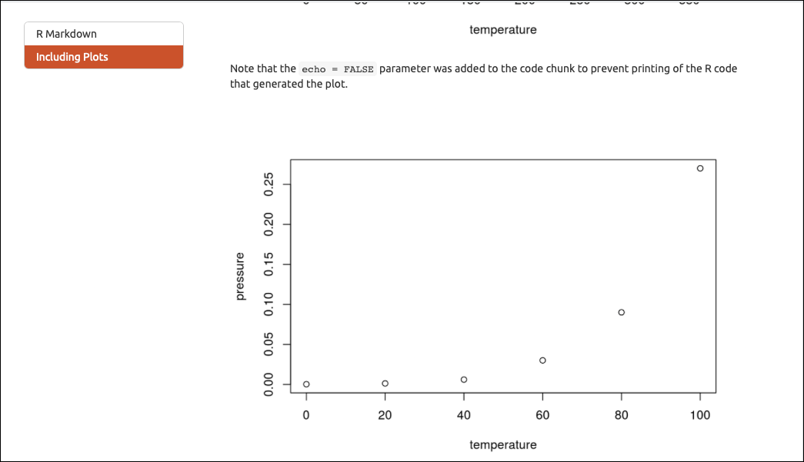
```

---
background-image: url(img/rmarkdown.png)
background-position: 93% 10%
background-size: 8%

# YAML output formats

Function       | Outputs
-------------- | --------------------------
`html_document()`   | HTML document
`pdf_document()`  | PDF document
`word_document()` | Word document
`odt_document()`   | ODT document
`rtf_document()`   | RTF document
`md_document()`   | Markdown document
`slidy_presentation()`   | Slidy Slides (HTML)
`beamer_presentation()`   | Beamer Slides (PDF)
`ioslides_presentation()`   | ioslides (HTML)
`powerpoint_presentation()`   | PowerPoint (pptx)

---
background-image: url(img/rmarkdown.png)
background-position: 93% 10%
background-size: 15%


# R Markdown

### ~~`.yaml` = Metadata~~
## `.md` = Prose
### ~~`.R` = Code~~


---
background-image: url(img/markdown.png)
background-position: 93% 10%
background-size: 8%
class: left, top

# Basic Markdown Syntax

## Italics & Bold

<br><br><br><br>

.pull-left[

```md
 *italic*   **bold**
 _italic_   __bold__
```

]

--

.pull-right[

 *italic*   **bold**  
 _italic_   __bold__

]

---
background-image: url(img/markdown.png)
background-position: 93% 10%
background-size: 8%
class: left, top

# Basic Markdown Syntax

## Headers

<br><br><br>

.pull-left[

```md
# Header 1
## Header 2
### Header 3
```

]

--

.pull-right[

# Header 1  
## Header 2  
### Header 3  

]

---
background-image: url(img/markdown.png)
background-position: 93% 10%
background-size: 8%
class: left, top

# Basic Markdown Syntax

## Bullets & Numeric Lists

<br><br><br>

.pull-left[

```md
 * Item 1
 * Item 2
    + Item 2a
    + Item 2b
    
 1. Item 1
 2. Item 2
```

]

--

.pull-right[

* Item 1  
* Item 2
    + Item 2a
    + Item 2b


 1. Item 1
 2. Item 2

]


---
background-image: url(img/markdown.png)
background-position: 93% 10%
background-size: 8%
class: left, top

# Basic Markdown Syntax

## Hyperlinks 

```md
https://www.biomarin.com/

[linked phrase](https://www.biomarin.com/)
```

### *becomes...*

--

[linked phrase](https://www.biomarin.com/)

---
background-image: url(img/markdown.png)
background-position: 93% 10%
background-size: 15%
class: left, top


# Basic Markdown Syntax

## Images 

```md


```

### *becomes...*

--

```{r Rlogo.png, echo = FALSE, out.height="30%", out.width="30%"}
knitr::include_graphics("https://www.r-project.org/logo/Rlogo.png")
```


---
background-image: url(img/markdown.png)
background-position: 93% 10%
background-size: 8%
class: left, top

# Basic Markdown Syntax

<br>

## Math Equations

.pull-left[

```md
$equation$

$$ equation $$
```

]

--

.pull-right[

$equation$

$$ equation $$

]


---
background-image: url(img/markdown.png)
background-position: 93% 10%
background-size: 8%
class: left, top

# Basic Markdown Syntax

## Super scripts & Strike-through 

.pull-left[

```md
superscript^2^
~~strikethrough~~
```
]

--

.pull-right[

 superscript^2^  

 ~~strikethrough~~

]

---
background-image: url(img/rmarkdown.png)
background-position: 7% 96%
background-size: 8%

# Exercise 5: Markdown Formatting

Delete the top portion of the markdown in `01-monthly-report.Rmd`. 

```{r delete-rmarkdown, echo = FALSE, out.height="100%", out.width="100%"}
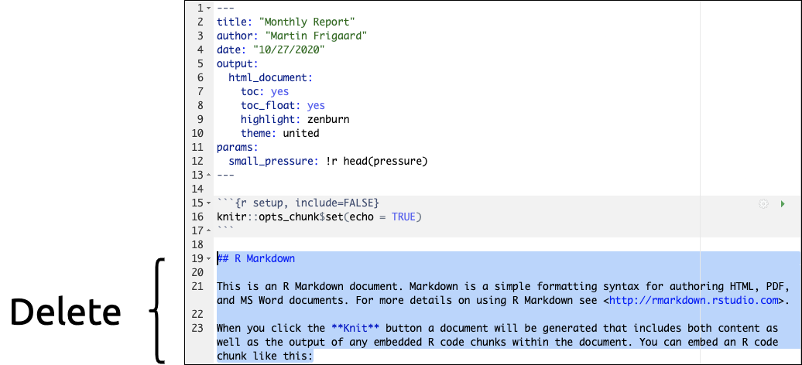
```

---
background-image: url(img/rmarkdown.png)
background-position: 7% 96%
background-size: 8%

# Exercise 5: Markdown Formatting

### Add the text below to your report 

> *This is a monthly report generated with RMarkdown, a literate programming tool for combining text and code.*

--

### Include the following formatting:

1. make `monthly report` italic  
2. include this hyperlink for `Rmarkdown`: https://rmarkdown.rstudio.com/
3. format `code` as code. 

--

### Knit the document when you're finished


---
background-image: url(img/rmarkdown.png)
background-position: 7% 96%
background-size: 8%

# Exercise 5: Markdown Formatting (rendered)

```{r rmarkdown-exercise, echo = FALSE, out.height="100%", out.width="100%"}
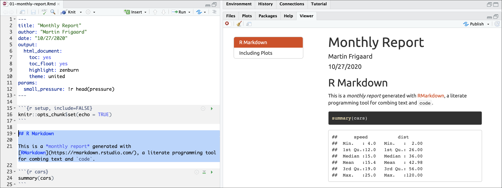
```

---
background-image: url(img/rmarkdown.png)
background-position: 93% 10%
background-size: 8%

# Exercise 6: Tabsets 

Remove the `toc` and `toc_float` options from your YAML header

```yaml
output: 
  html_document: 
    highlight: zenburn
    theme: united
params: 
  small_pressure: !r head(pressure)
```

---
background-image: url(img/rmarkdown.png)
background-position: 93% 10%
background-size: 8%

# Exercise 6: Tabsets 

Make the following changes to the `R Markdown` header sections


```{r tabset-markdown, echo = FALSE, out.height="100%", out.width="100%"}
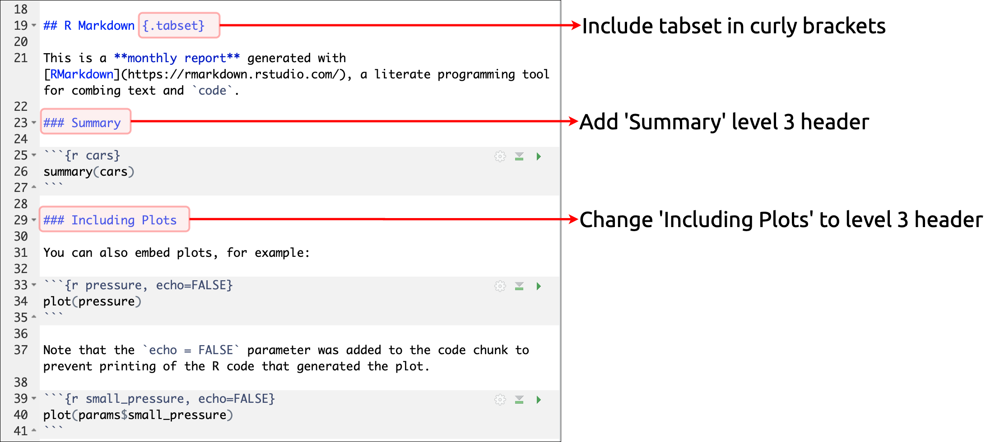
```

### Knit the document again

---
background-image: url(img/rmarkdown.png)
background-position: 93% 10%
background-size: 8%

# Exercise 6: Tabsets (rendered)

```{r tabset-1-render, echo = FALSE, out.height="100%", out.width="100%"}
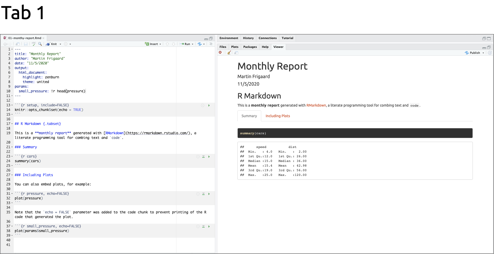
```

---
background-image: url(img/rmarkdown.png)
background-position: 93% 10%
background-size: 8%

# Exercise 6: Tabsets (rendered)

```{r tabset-2-render, echo = FALSE, out.height="100%", out.width="100%"}
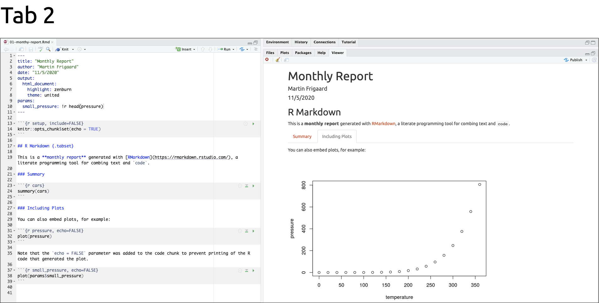
```

---
background-image: url(img/rmarkdown.png)
background-position: 93% 10%
background-size: 12%

# R Markdown

### ~~`.yaml` = Metadata~~
### ~~`.md` = Prose~~
## `.R` = Code


---
background-image: url(img/rmarkdown.png)
background-position: 93% 10%
background-size: 8%

# Code chunks (`setup`)

### The first bit of R code in our RMarkdown file is the `setup` chunk

```{r setup-code-chunk, echo = FALSE, out.height="100%", out.width="100%"}
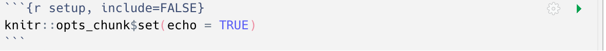
```

--

### Chunks named '`setup`' are special because they can set global options

--

### '`include=FALSE`' means this code is run, but not displayed

---
background-image: url(img/rmarkdown.png)
background-position: 93% 10%
background-size: 8%

# Code chunks (`setup`)

### R Markdown document options come from the `knitr` package

### We can access both the with sytnax below:

```{r knitr-opts-set, echo = FALSE, out.height="75%", out.width="75%"}
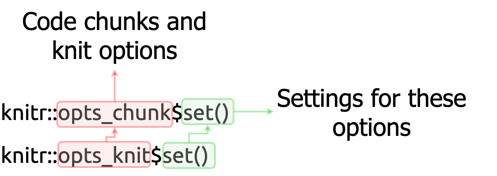
```

---
background-image: url(img/rmarkdown.png)
background-position: 93% 10%
background-size: 8%

# Code chunks (`setup`)

### The `echo=TRUE` option controls whether we want to display the code in the code chunk 

--

### Other common options regarding code are `eval`, `tidy`, `error`, `message`, and `warning`

--

### Advanced options can control language engines (`engine`), caching (`cache`, `dependson`), and plot animations (`fig.show`)


---
background-image: url(img/rmarkdown.png)
background-position: 93% 10%
background-size: 8%

# Code chunks (`setup`)

### Many options for code chunks 

|Option          | Document Effect                              |
|:-------------- |:-------------------------------------------- |
|`include`       | run code, but do/don't print code and results|
|`eval`          | do/don't evaluate the code                   |
|`echo`          | run code, but don't print code               |
|`message`       | do/don't print messages (e.g. from functions)|
|`warning`       | do/don't print warnings                      |

---
background-image: url(img/rmarkdown.png)
background-position: 93% 10%
background-size: 8%

# Code chunks

<br><br><br><br>

```{r code-chunks, echo = FALSE, out.height="70%", out.width="70%", fig.align='center'}
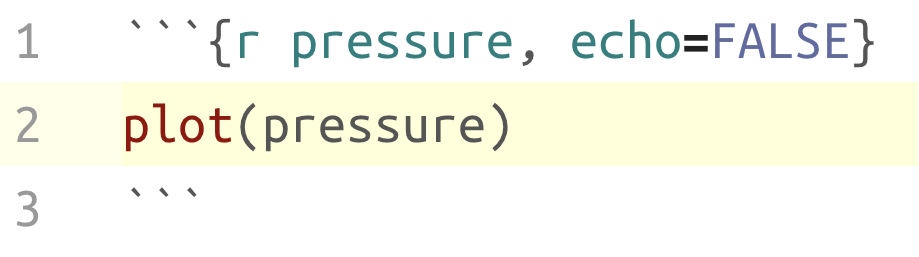
```

---
background-image: url(img/rmarkdown.png)
background-position: 93% 10%
background-size: 8%

# Code chunk fences

<br><br>

```{r code-chunk-fences, echo = FALSE, out.height="70%", out.width="70%"}
  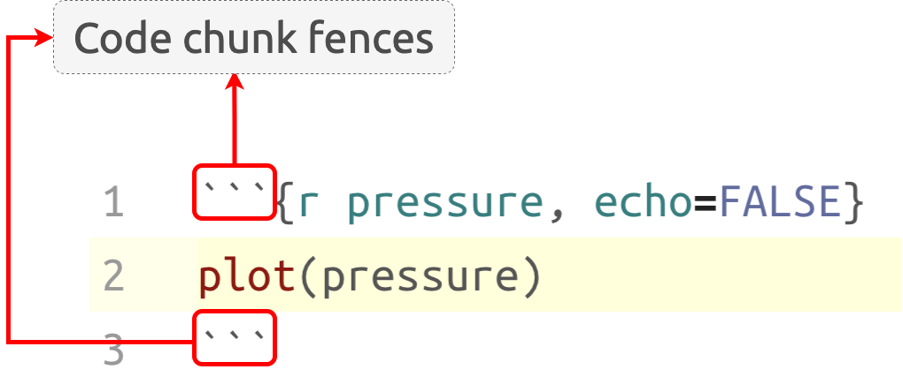
```

---
background-image: url(img/rmarkdown.png)
background-position: 93% 10%
background-size: 8%

# Code chunk names and arguments

```{r code-chunk-label-args, echo = FALSE, out.height="80%", out.width="80%"}
  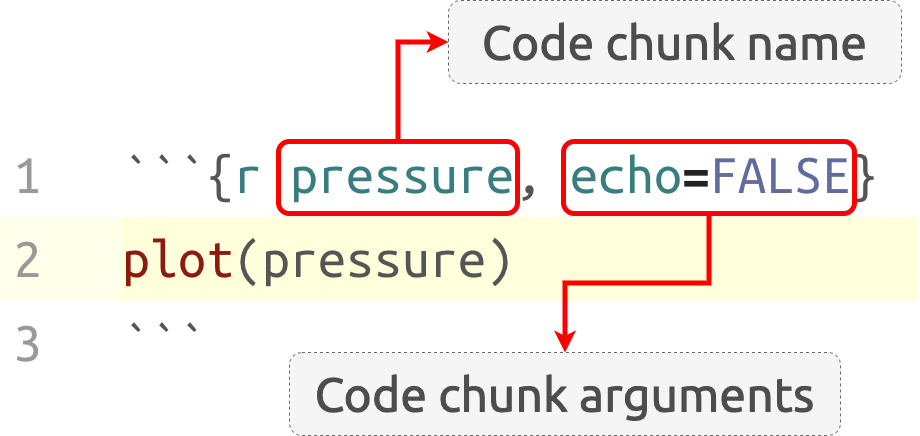
```


--

### See the [knitr web page](https://yihui.name/knitr/options/) for complete list of options

---
background-image: url(img/rmarkdown.png)
background-position: 93% 10%
background-size: 8%

# Inserting code chunks

### Use keyboard shortcuts **CMD/CTRL + I** or **ALT/OPTION + I**


```{r insert-code-chunk, echo = FALSE, out.height="23%", out.width="23%"}
knitr::include_graphics("img/insert-code-chunk.png")
```

---
background-image: url(img/rmarkdown.png)
background-position: 93% 10%
background-size: 8%

# Edit code chunk options

### You can edit code chunk options using the icon (small gear)

```{r code-chunk-settings, echo = FALSE, out.height="50%", out.width="50%"}
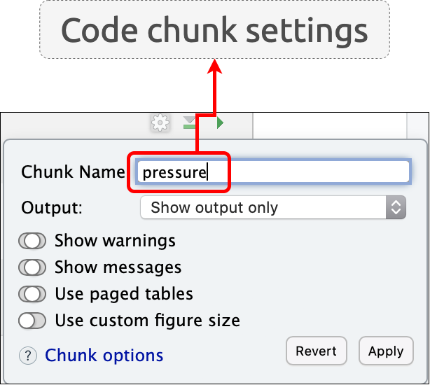
```


---
background-image: url(img/rmarkdown.png)
background-position: 93% 10%
background-size: 8%

# Code Chunk Engines

## More and more code engines all the time 

```{r knit_engines}
names(knitr::knit_engines$get())
```

## Even SAS!


---
background-image: url(img/rmarkdown.png)
background-position: 7% 96%
background-size: 8%

# Exercise 7: code chunks (kable)

### Create a new heading and code chunk 

Create a new `Tables` level three header under the `Summary` heading, 

```md
### Tables
```

--

Insert the following code chunk under `Tables` (*manually, with the keyboard short-cut, or use the "Insert" button*)

```{r kable-code-chunk, echo = FALSE, out.height="100%", out.width="100%"}
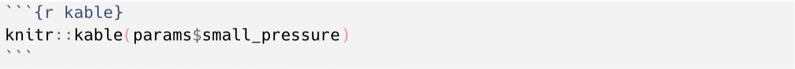
```

### Knit the document

---
background-image: url(img/rmarkdown.png)
background-position: 93% 10%
background-size: 8%

# Exercise 7: code chunks (kable rendered)

We can see the `small_pressure` parameter from the YAML has been rendered in the new `Tables` tab. `kable` tables are great for presenting small, summary tables.

```{r kable-chunk-rendered, echo = FALSE, out.height="90%", out.width="90%"}
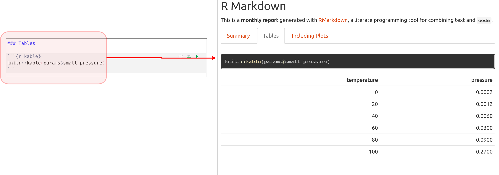
```

Read more about `kable` table options [here](https://bookdown.org/yihui/rmarkdown-cookbook/kable.html) 

---
background-image: url(img/rmarkdown.png)
background-position: 93% 96%
background-size: 8%

# Exercise 8: code chunks (paged)

### We are going to repeat the process above, but with a larger table (`mtcars`)

Insert the following code chunk above the `knitr::kable()` output: 

```{r paged-code-chunk, echo = FALSE, out.height="100%", out.width="100%"}
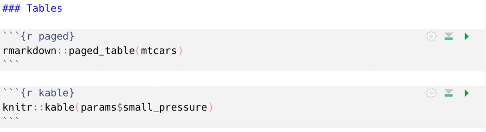
```

### Knit the document

---
background-image: url(img/rmarkdown.png)
background-position: 7% 96%
background-size: 8%

# Exercise 8: code chunk (paged rendered)

### Paged tables are great for larger datasets

```{r paged-chunk-render, echo = FALSE, out.height="90%", out.width="90%", fig.align='center'}
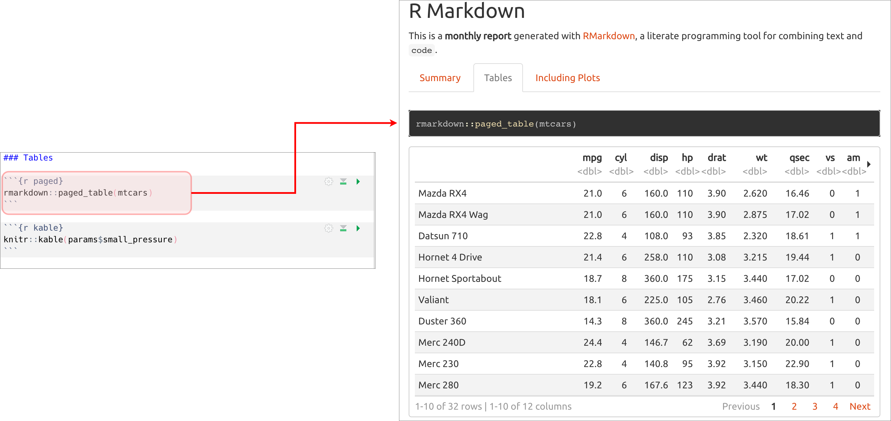
```

---
background-image: url(img/rmarkdown.png)
background-position: 93% 10%
background-size: 8%

# Exercise 8: paged tables

```{r paged-chunk-render-gif, echo = FALSE, out.height="100%", out.width="100%", fig.align='center'}
knitr::include_graphics("img/paged-chunk-render.gif")
```

---
background-image: url(img/rmarkdown.png)
background-position: 93% 10%
background-size: 8%

# Inline R Code

### R Markdown also supports inline R code 

--


```{r inline-r-code-01, echo = FALSE, out.height="100%", out.width="100%"}
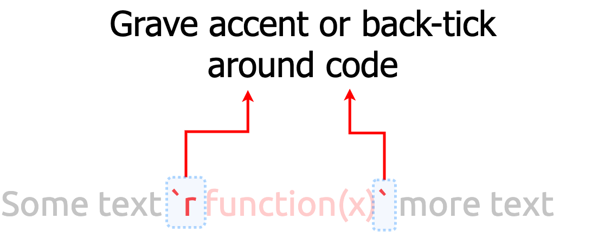
```

---
background-image: url(img/rmarkdown.png)
background-position: 93% 10%
background-size: 8%

# Inline R Code

### Inline R code allows us to include summaries of our analysis in the report

--

```{r inline-r-code-02, echo = FALSE, out.height="100%", out.width="100%"}
knitr::include_graphics("img/inline-r-code-02.png")
```


---
background-image: url(img/rmarkdown.png)
background-position: 93% 10%
background-size: 8%

# Exercise 9: Add Inline Code

### We're going to add a Pearson correlation between speed and stopping distance to the `01-monthy-report.Rmd` 

--

### Include the following code under the `Summary` level three header

```{r inline-code, eval=FALSE}
The correlation between speed and stopping distance 
is `r cor(x = cars$speed, y = cars$dist)`
```

--

### Knit the document again

---
background-image: url(img/rmarkdown.png)
background-position: 93% 10%
background-size: 8%

# Exercise 9: Add Inline Code (rendered)


```{r inline-code-rendered, echo = FALSE, out.height="100%", out.width="100%"}
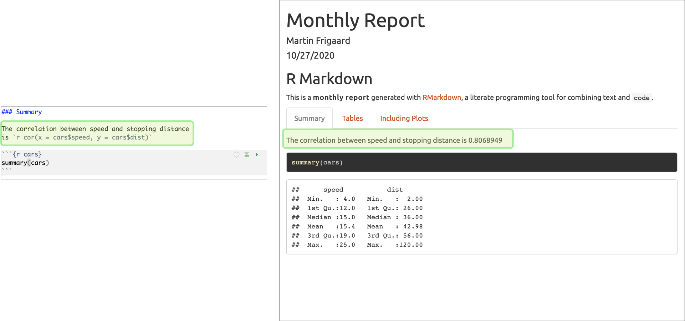
```

---
background-image: url(img/rmarkdown.png)
background-position: 93% 50%
background-size: 20%

# Make cool stuff in R Markdown!

## `bookdown`
## `blogdown`
## these slides!

---
background-image: url(img/rmarkdown.png)
background-position: 93% 10%
background-size: 8%
class: left, top

# Resources

<br>

- **YAML**: check out the [`ymlthis` package](https://r-lib.github.io/ymlthis/) for tools and documentation for working with YAML

- **Markdown**: [Commonmark](https://commonmark.org/help/tutorial) has a quick ten-twenty minute tutorial on markdown.

- [R Markdown](https://bookdown.org/yihui/rmarkdown/): A comprehensive but friendly introduction to R Markdown and friends. Free online!

- [R for Data Science](http://r4ds.had.co.nz/): A comprehensive but friendly introduction to the tidyverse. Free online.

- [R Markdown for Scientists](https://rmd4sci.njtierney.com/): R Markdown for Scientists workshop material
